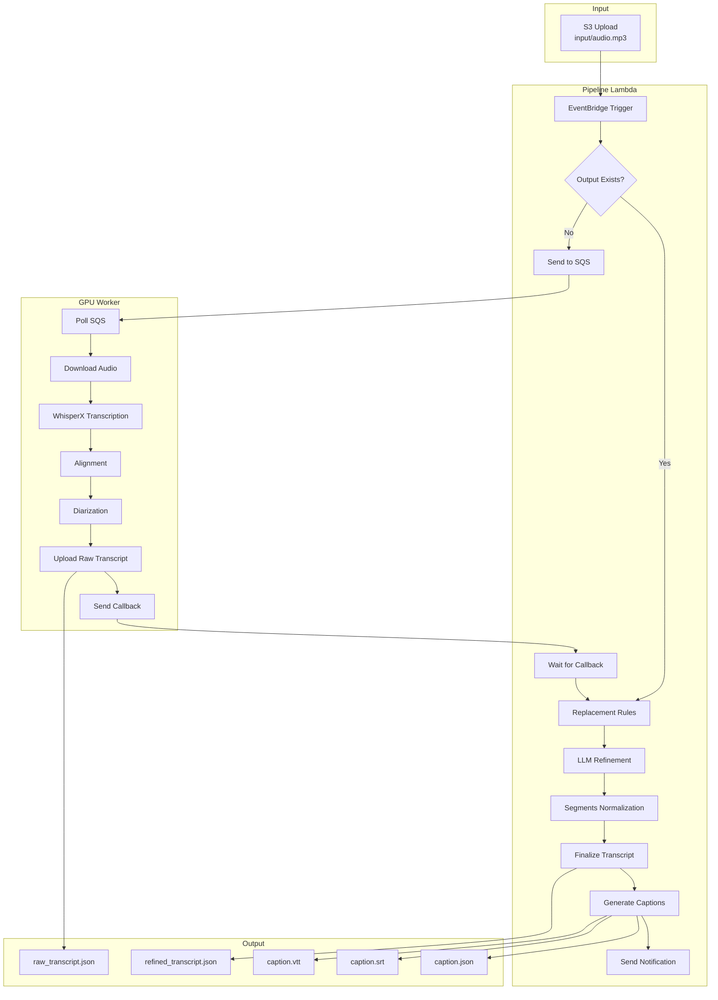

# 🎙️ podwhisperer v2

A serverless transcription pipeline optimized for podcasts. It comes with GPU-accelerated transcription, speaker diarization, and LLM-powered refinement.


## ✨ What's New in v2

This is the successor to [podwhisperer (v1)](https://github.com/fourTheorem/podwhisperer/tree/1.0.0), rebuilt from the ground up with AWS CDK, [WhisperX](https://github.com/m-bain/whisperX) running on ECS Managed Instances, and a modular pipeline architecture built as a Durable Lambda Function.

- **AWS Durable Execution** - Long-running workflows survive Lambda timeouts with automatic checkpointing
- **LLM-Powered Refinement** - Uses Amazon Bedrock to fix transcription errors and identify speakers by name
- **Caption Generation** - Automatic VTT, SRT, and JSON caption output with word-level timing
- **Managed GPU Instances** - ECS Managed Instances with automatic provisioning (no more EC2 management): instances only run when needed
- **Scale-to-Zero** - Zero cost when idle, automatic spin-up when work arrives
- **Modular Pipeline** - Each step is configurable and can be enabled/disabled independently

## 🛠️ Technology Stack

- **AWS CDK** (TypeScript) - Infrastructure as Code
- **AWS Lambda** with Durable Execution - Pipeline orchestration (TypeScript)
- **Amazon ECS** with Managed Instances - GPU worker containers
- **WhisperX** - Speech recognition with word-level timestamps and speaker diarization (Worker in Python)
- **Amazon Bedrock** - LLM-based transcript refinement
- **Amazon S3** - Audio input and output storage
- **Amazon SQS** - Message queue for GPU worker tasks
- **Amazon EventBridge** - S3 event triggers and completion notifications

## 🏗️ Architecture



## ⚙️ Pipeline Steps

### Step 0: Transcription (GPU Worker)

The WhisperX container runs on GPU-enabled ECS Managed Instances:

1. **Download** - Fetches audio from S3 `input/` prefix
2. **Validation** - Checks audio format and converts to WAV if needed
3. **Transcription** - Runs WhisperX with the configured model (default: `large-v2`)
4. **Alignment** - Generates word-level timestamps
5. **Diarization** - Identifies and labels different speakers
6. **Upload** - Saves raw transcript to S3 `output/` prefix

### Step 1: Replacement Rules (Optional)

Apply regex or literal string replacements to fix common transcription errors:

```json
{
  "replacementRules": [
    { "type": "literal", "search": "AWS lamda", "replacement": "AWS Lambda" },
    { "type": "regex", "search": "\\bec2\\b", "replacement": "EC2" }
  ]
}
```

### Step 2: LLM Refinement (Optional)

Uses Amazon Bedrock to improve transcript quality:

- Fixes spelling and grammar errors while preserving meaning
- Identifies speakers by name when possible (e.g., "SPEAKER_00" becomes "Luciano")
- Validates suggestions to prevent aggressive rewrites

### Step 3: Segments Normalization

Splits long transcript segments into caption-friendly chunks:

- Respects character and word limits per segment
- Splits at natural punctuation boundaries
- Handles speaker changes within segments

### Step 4: Caption Generation

Generates multiple caption formats from the refined transcript:

- **VTT** - WebVTT format for web players
- **SRT** - SubRip format for video editors
- **JSON** - Simplified format for custom applications

Optional features:
- Word-by-word highlighting (underline, bold, or italic)
- Speaker name prefixes (always, when speaker changes, or never)

### Step 5: Notification

Sends an EventBridge event when the pipeline completes, including:

- Input/output S3 keys
- Pipeline timing statistics
- All generated output paths

## 📋 Prerequisites

1. **AWS Account** with appropriate permissions
2. **AWS CLI** configured with credentials
3. **Node.js** 22+ and **pnpm** 9+
4. **Docker** running locally (for container builds)
5. **HuggingFace Token** with access to pyannote models ([details below](#setting-up-the-huggingface-token))

### Setting up the HuggingFace Token

The diarization models require a HuggingFace token. Follow these steps to create one:

#### 1. Create a HuggingFace Account

If you don't have one, sign up at [huggingface.co](https://huggingface.co/join).

#### 2. Accept the Model Licenses

Visit the following model pages and accept their license agreements:

- [pyannote/segmentation-3.0](https://huggingface.co/pyannote/segmentation-3.0) - Click "Agree and access repository"
- [pyannote/speaker-diarization-3.1](https://huggingface.co/pyannote/speaker-diarization-3.1) - Click "Agree and access repository"

#### 3. Create an Access Token

1. Go to [HuggingFace Settings → Access Tokens](https://huggingface.co/settings/tokens)
2. Click **"Create new token"**
3. Select **"Read"** as the token type (fine-grained)
4. Give it a name (e.g., `podwhisperer`)
5. Under **Permissions**, enable only:
   - ✅ **Read access to contents of all repos under your personal namespace**
   - ✅ **Read access to contents of all public gated repos you can access**
6. Click **"Create token"** and copy the token value

#### 4. Store the Token in AWS SSM

```bash
aws ssm put-parameter \
  --name "/podwhisperer/hf_token" \
  --type "SecureString" \
  --value "hf_your_token_here"
```

> [!IMPORTANT]
> **Security Note:** This token is embedded in the Docker image as a build argument and environment variable, making it visible at the container level. This is required because we pre-load all models (Whisper, segmentation, diarization) into the container image at build time, enabling faster job processing without re-downloading models for each transcription.
>
> While this may be flagged as a security concern, it is acceptable for most deployments if:
> - The token has **read-only** permissions (as configured above)
> - The token only grants access to public gated models
>
> If you're uncertain or have strict security requirements, consider creating a **dedicated HuggingFace account** with no private content and generate the token from that account.

## 🚀 Getting Started

### 1. Clone and Install

```bash
git clone https://github.com/fourTheorem/podwhisperer.git
cd podwhisperer
pnpm install
```

### 2. Configure the Pipeline

Create a `cdk/config.ts` file to configure your pipeline. An example is provided at `cdk/config.example.ts`:

```typescript
// cdk/config.ts
import { defineConfig } from '@podwhisperer/config'

export default defineConfig({
  transcription: {
    model: 'large-v2',
    language: 'en',
    minSpeakers: 2,
    maxSpeakers: 4,
  },
  llmRefinement: {
    bedrockInferenceProfileId: 'eu.anthropic.claude-sonnet-4-20250514-v1:0',
    additionalContext: 'This is a tech podcast about AWS and serverless.',
  },
  captions: {
    highlightWords: true,
    includeSpeakerNames: 'when-changes',
  },
})
```

The `defineConfig()` helper provides type safety and IDE autocomplete for all configuration options. This pattern is similar to popular tools like Vite, Vitest, and ESLint.

### 3. Deploy

```bash
pnpm cdk deploy
```

### 4. Upload Audio

```bash
# Get the bucket name from the stack output
BUCKET=$(aws cloudformation describe-stacks \
  --stack-name Podwhisperer \
  --query 'Stacks[0].Outputs[?OutputKey==`BucketName`].OutputValue' \
  --output text)

# Upload your audio file
aws s3 cp my-podcast.mp3 s3://$BUCKET/input/my-podcast.mp3
```

The pipeline will automatically trigger and generate outputs in `s3://$BUCKET/output/`.

## 📖 Configuration Reference

### Transcription

| Option | Type | Default | Description |
|--------|------|---------|-------------|
| `model` | string | `"large-v2"` | Whisper model name (`tiny`, `base`, `small`, `medium`, `large-v1`, `large-v2`, `large-v3`) |
| `language` | string | `"en"` | Language code for transcription |
| `minSpeakers` | number | `1` | Minimum speakers for diarization |
| `maxSpeakers` | number | auto | Maximum speakers (undefined = auto-detect) |
| `jobTimeoutMinutes` | number | `60` | Timeout for transcription job (max: 720 due to SQS limit) |
| `skipIfOutputExists` | boolean | `false` | Skip transcription if output already exists |
| `hfTokenSsmPath` | string | `"/podwhisperer/hf_token"` | SSM parameter path for HuggingFace token |

### Replacement Rules

Array of replacement rules, each with:

| Option | Type | Description |
|--------|------|-------------|
| `type` | `"regex"` \| `"literal"` | Matching type |
| `search` | string | Pattern or string to find |
| `replacement` | string | Text to replace matches with |

### LLM Refinement

| Option | Type | Default | Description |
|--------|------|---------|-------------|
| `bedrockInferenceProfileId` | string | required | Bedrock inference profile (e.g., `"eu.anthropic.claude-sonnet-4-20250514-v1:0"`) |
| `additionalContext` | string | - | Context to help the LLM understand domain-specific terms |
| `modelConfig.max_tokens` | number | `64000` | Maximum tokens in response |
| `modelConfig.temperature` | number | `0.2` | Model temperature |
| `suggestionValidation.enabled` | boolean | `true` | Enable validation of LLM suggestions |
| `suggestionValidation.maxWordChangeRatio` | number | `0.4` | Max percentage of words that can change (0-1) |
| `suggestionValidation.maxNormalizedEditDistance` | number | `0.5` | Max normalized edit distance (0-1) |
| `suggestionValidation.maxConsecutiveChanges` | number | `3` | Max consecutive word changes allowed |

### Normalization

| Option | Type | Default | Description |
|--------|------|---------|-------------|
| `normalize` | boolean | `true` | Enable segment normalization |
| `maxCharsPerSegment` | number | `48` | Max characters per caption segment |
| `maxWordsPerSegment` | number | `10` | Max words per caption segment |
| `splitSegmentAtSpeakerChange` | boolean | `true` | Force split when speaker changes |
| `punctuationSplitThreshold` | number | `0.7` | Threshold for splitting at punctuation (0-1) |
| `punctuationChars` | string[] | `[".", ",", "?", "!", ";", ":"]` | Characters that can end a segment |

### Captions

| Option | Type | Default | Description |
|--------|------|---------|-------------|
| `generateVtt` | boolean | `true` | Generate WebVTT captions |
| `generateSrt` | boolean | `true` | Generate SRT captions |
| `generateSimplifiedJson` | boolean | `true` | Generate JSON captions |
| `highlightWords` | boolean | `false` | Enable word-by-word highlighting |
| `highlightWith` | `"underline"` \| `"bold"` \| `"italic"` | `"underline"` | Highlight style |
| `includeSpeakerNames` | `"never"` \| `"always"` \| `"when-changes"` | `"when-changes"` | When to show speaker names |

### Notification

| Option | Type | Default | Description |
|--------|------|---------|-------------|
| `enabled` | boolean | `true` | Send EventBridge notification on completion |
| `eventBusName` | string | `"default"` | EventBridge event bus name |
| `source` | string | `"podwhisperer.pipeline"` | Event source identifier |
| `detailType` | string | `"Pipeline Completed"` | Event detail type |

## 📁 Output Files

For an input file `input/episode-42.mp3`, the pipeline generates:

| File | Description |
|------|-------------|
| `output/episode-42_raw_transcript.json` | Raw WhisperX output with word-level timing |
| `output/episode-42_refined_transcript.json` | Post-processed transcript with all refinements |
| `output/episode-42_caption.vtt` | WebVTT captions |
| `output/episode-42_caption.srt` | SRT captions |
| `output/episode-42_caption.json` | Simplified JSON captions with speaker mapping (custom format, useful for example for generating static sites or dynamic visualizations) |

## 💰 Cost Considerations

This pipeline uses several billable AWS services:

| Service | Cost Driver | Notes |
|---------|-------------|-------|
| **EC2 GPU Instances** | ~$0.50-1.00/hour (on-demand) | g4dn.xlarge or similar; scales to zero when idle |
| **Amazon Bedrock** | ~$3-15 per 1M tokens | Varies by model; Claude Sonnet used for refinement |
| **S3 Storage** | ~$0.023/GB/month | Audio files + transcripts |
| **Lambda** | Minimal | Durable execution included in Lambda pricing |
| **SQS** | Minimal | First 1M requests/month free |

**Typical cost for a 1-hour podcast:** $0.15-0.50 (GPU time for ~10-15 min) + LLM tokens if enabled

To minimize costs:
- Scale-to-zero is enabled by default (no GPU costs when idle)
- Disable LLM refinement if not needed (`llmRefinement: undefined`)
- Use a smaller Whisper model (`medium` instead of `large-v2`)

## 🧹 Cleanup

To tear down all resources and stop incurring costs:

```bash
pnpm cdk destroy
```

This removes:
- S3 bucket (will fail if not empty; empty it first or use `--force`)
- ECS cluster and GPU capacity provider
- Lambda functions and log groups
- SQS queues and EventBridge rules

To empty the S3 bucket before destroying:

```bash
aws s3 rm s3://$BUCKET --recursive
```

## 🔄 Re-processing Files

### Default Behavior

By default, uploading the same file again triggers a full re-processing. The previous outputs are overwritten.

### Skip If Output Exists

To avoid re-processing files that already have outputs:

```typescript
transcription: {
  skipIfOutputExists: true,
  // ...
}
```

With this enabled, the pipeline checks for existing output files and skips transcription if found. Post-processing steps still run, allowing you to update LLM refinement or caption settings without re-transcribing.

### Force Re-processing

To force re-processing when `skipIfOutputExists` is enabled:

1. Delete the output files:
   ```bash
   aws s3 rm s3://$BUCKET/output/episode-42_raw_transcript.json
   ```

2. Re-upload the input file:
   ```bash
   aws s3 cp my-podcast.mp3 s3://$BUCKET/input/episode-42.mp3
   ```

## 📡 Consuming EventBridge Notifications

When the pipeline completes, it sends an event to EventBridge. You can create rules to trigger downstream workflows.

### Event Schema

```json
{
  "source": "podwhisperer.pipeline",
  "detail-type": "Pipeline Completed",
  "detail": {
    "bucket": "podwhisperer-bucket-abc123",
    "inputKey": "input/episode-42.mp3",
    "outputKeys": {
      "rawTranscript": "output/episode-42_raw_transcript.json",
      "refinedTranscript": "output/episode-42_refined_transcript.json",
      "captions": {
        "vtt": "output/episode-42_caption.vtt",
        "srt": "output/episode-42_caption.srt",
        "json": "output/episode-42_caption.json"
      }
    },
    "timing": {
      "pipelineStartedAt": "2025-01-26T12:00:00.000Z",
      "pipelineCompletedAt": "2025-01-26T12:15:30.000Z",
      "pipelineDurationMs": 930000
    }
  }
}
```

### Example: Lambda Trigger

```typescript
// In your CDK stack
const rule = new events.Rule(this, 'PodwhispererComplete', {
  eventPattern: {
    source: ['podwhisperer.pipeline'],
    detailType: ['Pipeline Completed'],
  },
});

rule.addTarget(new targets.LambdaFunction(myDownstreamLambda));
```

### Example: SNS Notification

```typescript
const topic = new sns.Topic(this, 'TranscriptReady');

const rule = new events.Rule(this, 'NotifyOnComplete', {
  eventPattern: {
    source: ['podwhisperer.pipeline'],
    detailType: ['Pipeline Completed'],
  },
});

rule.addTarget(new targets.SnsTopic(topic));
```

## 🔥 Pre-warming GPU Capacity

Since the pipeline uses ECS Managed Instances with scale-to-zero, the first transcription after a period of inactivity can take 5-15 minutes while AWS provisions GPU capacity and starts the container (~15GB image).

To avoid this cold start delay, you can send a **warmup message** to the SQS queue ahead of time, keeping the GPU worker alive and ready for incoming jobs.

### Sending a Warmup Message

```bash
# Get the queue URL from stack outputs
QUEUE_URL=$(aws cloudformation describe-stacks \
  --stack-name Podwhisperer \
  --query 'Stacks[0].Outputs[?OutputKey==`QueueUrl`].OutputValue' \
  --output text)

# Send a warmup message (keep warm for 30 minutes - default)
aws sqs send-message \
  --queue-url $QUEUE_URL \
  --message-body '{"type": "warmup"}'

# Or specify a custom duration
aws sqs send-message \
  --queue-url $QUEUE_URL \
  --message-body '{"type": "warmup", "until": "2025-01-15T14:30:00Z"}'
```

### Warmup Message Schema

| Field | Type | Required | Description |
|-------|------|----------|-------------|
| `type` | `"warmup"` | Yes | Identifies this as a warmup message |
| `until` | ISO 8601 timestamp | No | When warmup expires (default: 30 minutes from receipt) |

### How It Works

1. When the worker receives a warmup message, it immediately acknowledges (deletes) it
2. The worker sets an internal "keep warm until" timestamp
3. During the warmup period, the normal auto-shutdown behavior (exit after 3 empty polls) is disabled
4. Normal transcription jobs continue to process as usual during warmup
5. Once the warmup period expires, normal auto-shutdown behavior resumes
6. **Multiple warmup messages**: If a new warmup message arrives while already warm, the warmup period is only extended (never shortened)

### When to Use Warmup

- **Scheduled batch processing**: Send a warmup message 10-15 minutes before uploading multiple files
- **User-triggered workflows**: Warm up capacity when a user starts a workflow that will need transcription
- **Predictable usage patterns**: If you know transcription jobs arrive at certain times, pre-warm beforehand

> **Cost Note:** Warmup keeps GPU instances running, which incurs costs (~$0.50-1.00/hour). Only use warmup when you expect jobs to arrive soon.

## 👩‍💻 Development

### TypeScript (CDK, Pipeline Lambda)

```bash
# Build all packages
pnpm run build

# Lint and format
pnpm lint
pnpm format

# Run tests
pnpm --filter @podwhisperer/pipeline test

# Synthesize CloudFormation (without deploying)
pnpm cdk synth

# Compare with deployed stack
pnpm cdk diff
```

### Python (GPU Worker)

```bash
cd whisperx-image

# Install dev dependencies
make install-dev

# Run linter
make lint

# Run formatter
make format

# Run tests
make test

# Run tests with coverage report
make test-cov
```

## 🙌 Contributing

Everyone is very welcome to contribute to this project. You can contribute just by submitting bugs or suggesting improvements by [opening an issue on GitHub](https://github.com/fourTheorem/podwhisperer/issues).

## 👨‍⚖️ License

Licensed under [MIT License](./LICENSE). © [fourTheorem](https://fourtheorem.com).
